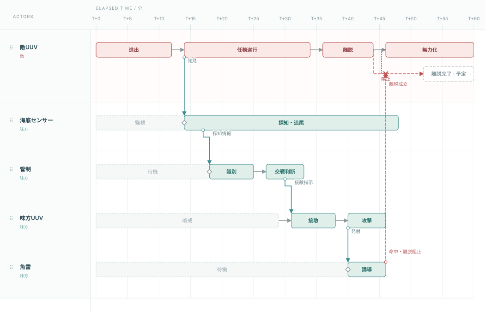

# IMEE — Mission State Timeline Editor

複数Actorの活動と因果関係を、時刻に比例したSVGタイムラインで編集する静的ツールです。

| 要素     | 表現ルール                                               |
| -------- | -------------------------------------------------------- |
| State    | 円形ノード。Actorがある時刻に到達した状態                |
| Task     | State間を結ぶ直線の矢印。Actorが時間をかけて実行する行為       |
| Junction | 必要な場所だけ表示する小さい白丸。Taskの分岐・因果合流点 |
| 正の因果 | 矩形波の矢印                                                 |
| 負の因果 | 滑らかな波線の矢印                                                 |

通常の活動は、2つのStateを1本のTaskで結びます。分岐する場合だけ白丸と結果ラベルを加えます。成功・失敗は「OK」「NG」などの文字で示し、線種で区別しません。Actorごとの色をState・Task・因果線に使います。線は起点Actorの色です。作用ラベルには線と同色の下線、Task・分岐結果のラベルには線と同色の枠を付けます。枠付きラベルは白背景で線上に配置します。「予定・案」の区分はありません。

**横位置は常に時刻です。** 重なるStateは同じActor内で上下に分かれます。経路を避ける場合も、StateやTask上の作用時点のX座標は変わりません。



## 起動

リポジトリをダウンロードし、`index.html` をブラウザで開いてください。`file://` 対応、ビルド・サーバー・実行時の外部CDN・インストールは不要です。開発時のテストのみNode.js 24とnpmを使います。

```sh
npm ci
npm test
```

## 操作

- Actor行の空白をダブルクリックしてStateを追加。点をドラッグして時刻を移動。Stateの期間やリサイズ操作はありません。
- **Alt / Option＋ドラッグ**で接続。選択後に**C**、または右クリック→「ここから接続」も利用できます。同一ActorのState間はTask、それ以外は因果リンクになります。正・負は作成後の編集ポップアップで指定します。
- Task・接続先の白丸・Taskへ入る因果線の右クリック、または詳細パネルから**分岐を追加**。受け手のActor・Taskを引き継ぎ、結果ラベルと既存／新規Stateを指定します。Taskの右クリックはクリック時刻、白丸・因果線は正確な接続時刻を使います。
- 同じTask・時刻へ到達する作用は、ダイアログ内にまとめて参考表示します。追加時点では作用との紐付け・分岐条件を自動設定しません。Simulation用の明示的な実行設定はTask・作用線編集で行います。元の到達先・終了時刻・介入時間窓を保ち、Task編集で既存結果のラベル・接続先・分岐時刻を編集できます。
- ダブルクリックまたは右クリックで編集。Task詳細には開始・終了・所要時間を表示します。時間の変更は、実際には接続元・先Stateまたは分岐点の時刻を変える操作です。
- Ctrl / ⌘＋クリックで複数選択。空白ドラッグでStateを矩形選択。選択したStateは一括ドラッグ・左右キー移動・削除・複製できます。
- Actorをダブルクリックし「Actorの色」で変更できます。色はJSON保存・読込、複製、Undo / Redoにも引き継がれます。
- Groupを折りたたむと子Actorの行を隠し、子孫のState・Taskを親Actorの色で一つのタイムラインに投影します。表示設定で「コンパクト（既定・28px間隔）」「1本に集約」「通常間隔」を切り替えられます。コンパクトはState名、1本はState・Task名をホバーで確認します。1本表示の要素をダブルクリックすると展開して編集できます。内部の因果線だけを隠し、外部との因果線は元の時刻のまま親に接続します。展開すると元に戻ります。
- Actorの中央へドラッグすると子Actorに、上端・下端へドラッグすると順番を変更。「まとめる」で新Group化、右クリックでGroup解除。Group複製は子Actor・State・Task・内部因果・Bindingを再帰コピーします。
- Ctrl / ⌘＋**D**で複製、**C / X / V**で文書内コピー・切り取り・貼り付け、**Z**でUndo、**Shift＋Z**でRedo、**G**でGroup化、**Shift＋G**で解除。Ctrl / ⌘＋Stateドラッグは複製移動です。
- 拡大縮小は表示時間範囲だけを変更し、横幅を固定します。下のスライダー・時間範囲指定、Space＋ドラッグでパン。Fで検索。詳細パネルは右下から開閉できます。

接続作成後のポップアップをキャンセルした場合、接続は初期ラベルのまま残ります。不要ならUndoで取り消してください。1つのStateだけを他Actorへ移動して接続整合性が崩れる場合は、操作を拒否します。

## 技術・因果・Gap

Technologyには `status: existing / research / planned / gap / unknown` と任意のTRLを登録できます。Task・作用の技術名は、そのラベルの直下にまとめて表示します。必要に応じてActor行の間隔を広げ、収まらない場合は対象付近の「技N」に集約します。ホバーで全文・成熟度・TRLを、選択で詳細を確認できます。Actor全体の技術・装備は詳細パネルで扱います。Stateへの新規紐付けは行わず、既存の紐付けは保持し、詳細パネルの「付け先変更」でTask・作用・Actorへ移せます。

Causality ViewはTaskを薄くし、因果リンクを強調します。どのViewでもCDF有効のTask・作用線は実線、所要時間・伝搬時間固定（FIX）のTask・作用線・分岐後の線は二重線です。表示のみの作用線は単線です。正の因果は矩形波、負の因果は滑らかな波線で、CDF/FIXと独立して形を保持します。正負の波は同じ振幅・周期で経路に沿い、矢じりは基準経路の方向に揃えます。`kind` は分析分類として保持し、線種や種類別色には使いません。

敵Taskを選ぶと、負の因果の到達時刻とTaskの介入時間窓、そこへ至るBlue側の方向付き経路を表示します。経路ごとに観測→判断→指令→攻撃の順序、技術の登録状況・成熟状況、時間窓を評価します。Gap Viewでは経路上の未成熟・未登録箇所を強調します。

SOMEは条件を充たす経路が1つ以上、ALLは列挙したすべての経路が充たすことを示します。経路の役割を混ぜて完結と判定しません。物理的な成功確率や実世界の実行可能性を推定する機能ではありません。詳しい判定規則は[データモデル](docs/data-model.md)を参照してください。

## Simulation

ツールバーの **Simulation** から、Taskの時間性能と作用線の伝搬時間をMission全体の成功率・完了時間へ伝播させるMonte Carloを実行できます。**シミュレーション例を開く** で、敵の弾道ミサイル本体と、広域レーダー・中央管制・中間軌道撃破用ユニット・終末軌道撃破用ユニットによる二段階迎撃の例を確認できます。

探知は「弾道ミサイルの発射State → 探知作用線（伝搬CDF）→ レーダーの目標探知State」と表し、探知未達なら後続の追尾・判断・迎撃を開始しません。ミサイルの基準飛行は独立して進みます。

迎撃ユニットは「準備完了 → 発射指示（固定10秒） → 迎撃ミサイル発射 → 軌道迎撃（CDF） → 迎撃」の流れです。迎撃CDFは発射から敵ミサイルの撃破達成までを表し、未達なら撃破作用を出しません。

Task編集の折りたたみ **Simulation / Performance** で、`F(t|w)=P(T≤t)` を表・グラフで編集します。最終累積確率が1未満なら残りを未達として扱います。CDF未設定のTaskは図上の所要時間で実行し、Actor間の依存は **追加依存State** に明示します。成功StateのAND / OR条件・期限・試行数・Seedを設定でき、成功率、95%区間、Mission/TaskのP50/P90、Criticality、待ち時間を表示します。

作用線編集の **Simulation / 作用線** で、実行タイプ（w伝播・作用分岐・State到達）と、伝搬時間（固定 / CDF）を別々に設定できます。CDFのtは発生から到着までの経過時間で、∞なら作用は届きません。結果に作用線の伝搬時間P50/P90、未達・未発生、Criticalityを表示します。

結果JSONには実行時の文書と設定を含み、同じSeedで再現できます。実行は中断でき、モデルを編集すると古い結果を無効化します。図上の時刻は実行で変更しません。

Taskを1回ずつ実行するイベントモデルです。確率分岐・作用線による分岐、敵側の撃破Stateへの遷移と後続中止、State/作用線からのw伝播を明示的に設定できます。時間/wの感度分析とMission要求からの性能境界の推定・成功率不足も表示します。未設定の分岐・循環は実行前に拒否します。Resource/数量は後続実装です。装備・環境・交戦の物理モデルは扱いません。詳しくは[Simulationの意味論・データ・統計](docs/simulation.md)を参照してください。

## 保存・出力

ブラウザ内に自動保存します。バックアップはJSON保存。右上メニューまたは空白の右クリックから、全期間・全階層のSVG / PNGを出力できます。画像出力で編集中のViewは変更しません。PNGは白背景・通常2倍解像度で、大きい図は16,384px／辺・3,200万画素以内へ縮小します。

**JSONはversion 2専用です。** 期間Stateを持つversion 1は明示エラーで拒否します。旧保存領域は上書きせず、新しい自動保存キーを使用します。

## JSONをLLMで生成する

[LLM向け生成仕様書](docs/llm-json-generation.md)と、[リポジトリ用SKILL](skills/imee-json-generator/SKILL.md)を用意しています。生成したファイルは以下で本体と同じ検証を実行できます。

```sh
node scripts/validate-mission.cjs examples/llm-example.json
node scripts/validate-mission.cjs mission.json
cat mission.json | node scripts/validate-mission.cjs -
```

配布例（旧版と同じシナリオ）：

- [基本サンプル](examples/coastal.json)：敵UUVの進出・任務遂行・離脱に対し、海底センサー→管制→味方UUV→魚雷が連携して離脱を阻止。
- [階層サンプル](examples/submarine.json)：同じミッションを潜水艦・ソナー・魚雷のActor階層で表示。
- [技術・Gapサンプル](examples/research.json)：同じ介入経路に、協調音響識別・水中指令通信の技術不足と54分の遅延案を表示。

Actor・行動期間・因果時刻・技術評価は、v2再設計直前の旧サンプルから保持しています。[新旧の図・変換対応表](docs/sample-migration.md)で直接比較できます。旧JSONとSVGも比較専用として保存しています。

操作説明用の小さな例は、別メニュー「表現デモ（捜索・識別・通信）」と `examples/tutorial/` に分離しています。[サンプル解説](docs/examples.md)も参照してください。

初期表示では技術注記を隠しています。技術表示を有効にすると、Gap Viewでは未成熟な技術、Technology Viewでは既存技術も含む注記を確認できます。旧例の技術評価・時間は説明用の仮定です。

比較用サンプルは `node scripts/restore-comparison-samples.cjs`、JSON・SVG・LLM完成例の同期は `node scripts/update-examples.cjs` で再生成します。

## 構成と検証

- `js/model.js`：version 2検証、階層、コピー、履歴、技術・経路分析。
- `js/layout.js`：時刻座標、サブレーン、共有ジャンクション、経路調整、波形、近傍ラベル。
- `js/render.js`：画面と出力で共通のSVG描画。
- `js/app.js`：選択、直接操作、編集ダイアログ、保存・出力。
- `js/performance.js` / `js/simulation.js`：CDF検証・補間・抽選、分岐・作用線・w伝播、Seed付きMonte Carloと統計。
- `js/sensitivity.js`：対応する乱数を使った時間/w介入、要求境界の評価。
- `js/simulation-ui.js`：CDF編集とMission成功条件・実行・結果画面。
- [データモデル](docs/data-model.md) / [手動確認](docs/manual-test.md)。

Node.jsとjsdomでモデル・描画・DOM操作・JSON・SVG・PNG出力処理を自動検証します。PNGテストのImage / Canvasは代替実装であり、ブラウザの画像エンコーダーそのものの検証ではありません。SVGをInkscapeで画像化して配置も確認しています。実ブラウザのfile://操作・フォント・PNGダウンロードは手動確認対象です。

State・Task・因果ラベルは対応する点・線の近傍に置きます。密集時は省略・Tooltip・軽微な重なりを許容します。技術名は対象ラベルと一体で配置し、狭い場所では短縮または「技N」に集約します。短いTaskなどでラベルを線上に置けない場合は、対象の近くに短い補助線で結んだ見出しを置きます。接続線を先に決め、ラベルを後から配置します。State名の長さでサブレーンや経路は変わりません。線は直線を基本とし、ノードや重なる区間だけを最大24pxの局所的な分離（最大3区間）で避けます。経路探索も有限候補であり、線の交差や過密図の完全解消を保証しません。OSクリップボード、共同編集は対象外です。
