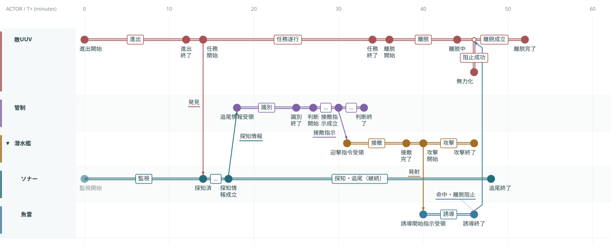

# IMEE — Mission State Timeline Editor

複数Actorの状態を時間に沿って並べ、状態変化の原因と、敵の予定遷移の阻止を追うための静的SVGエディタです。

**`index.html` をブラウザで開くだけで利用できます。ビルド・サーバー・外部CDNは不要です。**



右上の `•••` →「潜水艦グループのサンプル」で、潜水艦配下のソナー・魚雷を試せます。既存データは読み込み確認まで置き換えません。

## 起動

このリポジトリをダウンロードまたはcloneして、`index.html` を開いてください。`styles.css` と `js/` は同じ場所に置いてください。

- デスクトップの現行Chrome / Edge / Firefox / Safariを対象にした実装です。全ブラウザの実機検証は未実施です。
- 開くと海域監視のサンプル、またはこのブラウザに自動保存した直前のミッションを表示します。
- ネットワーク通信を行いません。JSONの読込・出力は利用者の端末内で完結します。
- 自動保存の利用可否はブラウザ設定や `file:` の扱いに依存します。バックアップ・移動には「JSON保存」を使ってください。

必要なら任意の静的サーバーでも動きます。例：`python -m http.server 8000`。GitHub Pagesにもそのまま配置できます。

## 表現のルール

| 要素           | 表現・意味                                                                   |
| -------------- | ---------------------------------------------------------------------------- |
| 横軸           | 経過時間。位置 = 開始時刻 × スケール。均等配置しません                       |
| Actorの階層    | Actorを親として入れ子に配置。グループにも自身のStateを持たせられます         |
| 縦軸           | Actor。所属は味方・敵・中立                                                  |
| State          | 一定期間続く状態。幅 = 継続時間 × スケール                                   |
| Transition     | 同一ActorのState同士を接続。前のStateの終了から次のStateの開始までが遷移期間 |
| 即時Transition | 所要時間0。境界の小さい菱形で選択できます                                    |
| Interaction    | 別Actorからの作用。発生時刻と到達時刻を持ちます                              |
| 予定           | 薄い破線のState・Transition                                                  |
| 平常・待機     | 薄い背景と控えめな文字・枠線                                                 |
| 遷移阻止       | 赤い太線のInteractionを予定Transitionに接続し、阻止時刻に×を表示             |
| 分岐・重複期間 | 同じActor内で自動的に段を分けます。横方向の時間位置は変えません              |

「予定」と「実際」は編集者が指定する区分です。予定が妨害されたことと、その後どうなったかを別々に記録します。並行Stateも許容するため、同一Actor内の重複はエラーにしません。

## 基本操作

接続の種類を選ぶモードボタンはありません。**Alt（MacはOption）を押しながらState本体から接続先へドラッグ**すると、接続先から種類を判定します。

| 接続先                      | 自動判定            |
| --------------------------- | ------------------- |
| 同じActorのState            | Transition（遷移）  |
| 異なるActorのState          | Interaction（作用） |
| 異なるActorの予定Transition | 予定遷移への妨害    |

Stateを選択してCキーを押し、接続先をクリックする方法、またはStateを右クリック →「ここから接続」も使えます。接続時に名前や発生・到達時刻をポップアップで確認・編集します。

| 操作                 | 方法                                                                    |
| -------------------- | ----------------------------------------------------------------------- |
| Actor・グループ追加  | 上部の「＋ Actor」「＋ グループ」／空白の右クリック                     |
| 子の追加             | Actorの右クリック →「子Actorを追加」「子グループを追加」                |
| 親を変更             | Actorの右クリック →「階層を変更」、または編集フォームの親欄             |
| グループ内へ移動     | 左のActor名をドラッグし、別Actor行の中央へドロップ。子孫も一緒に移動    |
| 並べ替え             | 移動先のActor行の上端・下端へドロップ／右クリックの上下移動             |
| 折りたたみ・展開     | Actor名の左の三角、または右クリック                                     |
| グループから取り出す | 右クリック →「子Actorを1階層外へ出す」。親自身のStateは保持             |
| State追加            | Actor行の空白をダブルクリック、または右クリック →「Stateを追加」        |
| State移動            | 本体をドラッグ。横方向は時間、縦方向はActorを変更                       |
| State複製            | Ctrl / ⌘ + ドラッグ、Ctrl+D、右クリック。複数選択の内部接続も複製       |
| State伸縮            | 左右のハンドルをドラッグ                                                |
| 項目編集・削除       | ダブルクリックで編集、右クリックで編集・削除・詳細表示                  |
| 因果の確認           | 項目を選び、詳細パネルの「接続された因果関係を強調」                    |
| 検索                 | 上部の「検索」またはF。閉じたグループ内の検索結果も自動展開して表示     |
| 拡大縮小             | ＋ / − または Ctrl / ⌘ + ホイール。横幅を固定し、表示時間範囲を変えます |
| 時間範囲の移動       | 下部スライダー・前後ボタン／Space + ドラッグ／Shift + ホイール          |
| 時間範囲の指定       | 下部の「T+… — T+…」ボタン／空白の右クリック                             |
| 全期間に戻る         | 「全体」                                                                |
| 詳細パネル           | 右下から開閉。画面内に重ねるためキャンバス幅は変わりません              |
| 保存・読込           | JSON保存／読込。読込の置き換えは確認し、Undoで戻せます                  |
| SVG出力              | 右上メニューまたは空白の右クリック。全期間・全階層を出力                |
| ミッション設定       | 上部のミッション名または右上メニュー。期間・単位・スナップを編集        |

`C` 選択Stateから接続、`F` 検索、`Esc` 取消、`Delete` 削除、`Enter` 編集、`Ctrl/⌘+Z` Undo、`Ctrl/⌘+Shift+Z` または `Ctrl+Y` Redo、`Ctrl/⌘+S` JSON保存。State選択後に `←` / `→` で移動、`Shift+←` / `Shift+→` で終了時刻を伸縮できます。

すべての機能を同じ作業画面から利用でき、編集はポップアップ、詳細・検索は開閉式パネルです。横スクロールは発生しません。Actorが多い場合の縦スクロールはキャンバス内に限定します。

折りたたみは子孫のデータを削除しません。画面から隠れるStateの件数を示し、外部Actorとの同種作用は `指令 ×3` のように束ねて表示します。個別の接続はTooltip・詳細パネルで確認できます。親自身のStateと、その予定遷移への阻止表示は維持します。SVG出力時には全階層を展開し、画面の表示時間・折りたたみ状態は維持します。

スナップはドラッグ・キーボード操作に適用します。フォームでは任意の時刻を入力できます。時間順序・接続・階層の制約を破る編集は元に戻し、理由を表示します。自身や子孫を親に指定することはできません。

## コンパクト表示と画像出力

Actor行は1レーン68px、時間目盛は48px、Actor列は最大176px。Stateの基本高さは32pxで、長い名称には必要な高さを追加します。時間に比例した横幅を維持し、余白を縮めています。標準サンプルは高さ674pxから444pxになります。既存文書で指定したレーン間隔は保持します。技術の吹き出しがある複数レーンでは重ならないよう52px以上の間隔を確保します。

技術は背景色・枠線・指示部のある吹き出しです。通常は短いタグ、Technology / Gap Viewでは技術名と状態を表示します。隣接する吹き出しを横にずらし、収まらない詳細は短縮します。全文はTooltipと詳細パネルで確認できます。

右上の `•••` または空白の右クリック → **「PNGを書き出す」**で、全期間・全階層を白背景のPNGに保存します。通常は表示幅の2倍の解像度。大きな図は画像全体が収まるよう倍率を自動的に下げます（最大16,384px／辺・3,200万画素）。現在のズーム・折りたたみ・選択は画像に持ち込まず、編集画面の表示状態は維持します。

## 文字と接続線の自動配置

Stateの横幅は継続時間を維持し、名称を改行・11〜9pxの文字サイズ・高さの拡張で収めます。高さが増えたStateに合わせて後続レーンとActor行も広がります。極端に狭いStateや8行を超える名称は省略し、Tooltip・Inspectorで全文を確認できます。

上下に並ぶStateへの作用は、下向きなら下辺→上辺、上向きなら上辺→下辺に接続します。別レーンへのTransitionも向かい合う辺に接続し、発生・到達の横位置は時刻のままです。

Transition・Interaction・折りたたみProxy・阻止のラベルは、State、接続線、技術吹き出し、他のラベルを避けて改行・移動します。離れたラベルには矢印なしの細い破線で補助線を付けます。図内に空きがない場合は下部へ配置し、横幅は増やしません。SVG・PNG出力にも同じ配置を反映します。

## 複数選択とコピー

- Ctrl / ⌘ + ClickでActor・Stateの選択を追加／解除。空白からドラッグで矩形選択。
- Ctrl / ⌘ + Dで選択対象を複製。Actorは子孫・State・内部接続・Bindingもコピーします。外部ActorとのInteractionはコピーしません。
- Ctrl / ⌘ + C / X / Vで文書内コピー・切り取り・貼り付け。新IDに内部参照を付け替えます。
- Ctrl / ⌘ + Gまたは「まとめる」で選択Actorを新Groupへ。Shiftを加えるとGroup解除。右クリックにも同じ操作があります。
- 複数Stateはドラッグ・左右キーでまとめて移動。複数Actorはまとめて並べ替え・親変更できます。Deleteでまとめて削除します。

## Technologyと分析View

上部のView選択は表示内容を変えます。接続の編集モードを切り替える必要はありません。

| View        | 内容                                                         |
| ----------- | ------------------------------------------------------------ |
| Mission     | 時間に沿った状態と因果。技術は背景・枠線付きの小さな吹き出し |
| Technology  | 技術名称タグ、技術カタログ、TRL・開発状態・Bindingの編集     |
| Gap         | 未成熟技術の依存先と、敵Transitionに対する候補経路の確認     |
| Interaction | Stateの背景を薄くして、種類別の色・破線・太さで作用を強調    |

「表示設定」でTechnology / Interaction / planned / quietを個別に非表示にできます。レーン高さも変更可能。折りたたみ・Actor順・倍率・表示時間範囲・フィルタは `views.main` に保存し、再読込で復元します。

State / Transition / Interaction / Actorを選択し、詳細パネルまたは右クリックの「技術を関連付け」を使います。技術状態は `existing / research / planned / gap / unknown`、TRLは1〜9または未評価。技術は共有カタログで、複製時はBindingのみ新IDでコピーします。

**右上の `•••` →「Technology / Gapのサンプル」**で、研究中の識別技術、未確保の通信技術、時間窓への到達が遅い介入案を確認できます。[サンプルJSON](examples/research.json)もあります。

敵Transitionを選ぶと、観測→判断→指令→攻撃の有向経路を表示します。判断はState編集の役割欄で明示します。経路は別々に評価し、技術Gapと未評価を表示。SOMEは条件充足の経路が1つ以上、ALLは列挙候補のすべてが充足という意味です。実世界の有効性・成功率の判定ではありません。[判定規則](docs/data-model.md#経路gap介入可能時間窓)を参照してください。

Transitionの開始〜終了を介入可能時間窓とし、到達時刻との関係を詳細パネルに表示します。時間窓外の案はInteraction編集で「検討案」にしてください。遅すぎる到達も保存して比較でき、阻止成立の×は付きません。

## 「敵ミッションの阻止」を編集する例

サンプルでは、敵UUVの `離脱（36–44分）→ 離脱完了（52–60分）` を予定Transitionとして登録しています。

1. 魚雷の `誘導（40–46分）` を作用元にします。
2. Altを押しながら魚雷のState本体から `離脱 → 離脱完了` の矢印へドラッグします。
3. 到達時刻を46分にし、妨害後のStateとして `無力化（46–60分）` を指定します。
4. 予定遷移上の46分に×が付き、赤い作用線と妨害後のStateへの点線を表示します。

`離脱 → 無力化` という実際のTransitionも別に登録しています。妨害後のStateの指定だけでは、StateやTransitionを自動生成しません。阻止の作用を削除すると予定遷移の阻止表示が消えますが、Stateや予定は保持します。

## LLMでミッションJSONを生成する

[LLM用JSON生成仕様書](docs/llm-json-generation.md) をLLMに添付し、シナリオと一緒に渡してください。フィールド・時間制約・技術評価・完成例を1ファイルにまとめています。

> 添付仕様に従い、次のシナリオをIMEEのJSONにしてください。出力はJSONのみ。時刻の補完は仮定としてnotesに記載し、不明な技術成熟度はunknown / nullにしてください。シナリオ：……

リポジトリを扱えるLLMには [JSON生成SKILL](skills/imee-json-generator/SKILL.md) を指定できます。生成したJSONは、追加パッケージなしで検証できます（Node.js 24以降）。

```sh
node scripts/validate-mission.cjs mission.json
```

検証後、アプリの「JSON読込」から開きます。[完成例](examples/llm-example.json) はグループ、予定遷移の阻止と結果分岐、4種類の技術Bindingを含みます。検証コマンドはエディタ本体と同じルールを使います。形式の検証と、シナリオの妥当性・技術条件の充足は別です。

## 保存形式と構成

詳細は [データモデル](docs/data-model.md) を参照してください。

```text
index.html             画面・ダイアログ
styles.css             UIスタイル
js/model.js            検証・自動レイアウト・履歴・参照の削除処理
js/sample.js           サンプルミッション
js/app.js              SVG描画・入力・ファイル入出力
examples/coastal.json   編集可能なサンプルデータ
examples/submarine.json 潜水艦・ソナー・魚雷の階層サンプル
examples/research.json  技術Gap・介入経路・遅延案のサンプル
```

アプリの実行依存はありません。以下のNode.js環境とjsdomは開発テスト用です。

## 開発・検証

Node.js 24以降：

```sh
npm ci
npm test
```

モデルの検証だけなら追加パッケージ不要で `node --test tests/model.test.cjs tests/research-model.test.cjs` を実行できます。

- 131件のモデル・DOM操作・JSON生成支援テストを実行します。
- モデル：時間比例、Actor階層の循環拒否、表示範囲、重複の自動段分け、参照整合性、時間順序、妨害と結果、削除の連鎖、Undo/Redo、JSON往復を検証。
- DOM操作：ドラッグ、複製、伸縮、Actor並べ替え、接続作成、Altドラッグ接続、ダイアログ、検索、JSON読込・出力、SVG出力、自動保存の復元を検証。
- SVG：実際の出力を画像に変換して図の配置を確認。
- **DOMテストは実ブラウザのE2Eテストではありません。** この実装環境では検証ブラウザのローカルファイルアクセスが拒否されたため、実ブラウザ上のポインター挙動・全体画面のレイアウトは未検証です。[手動確認手順](docs/manual-test.md) を用意しています。

## 現段階の範囲

- 時間は0以上の相対時刻。単位は秒・分・時間。単位切替は数値の自動換算をしません。
- Stateは正の継続時間、Transitionは0以上の所要時間です。
- State宛Interactionはその開始時刻を到達時刻にします。遷移中の妨害はTransition自体を対象にします。
- 接続時刻はStateの移動・編集に追従しますが、時間順序を保てない場合は編集を拒否します。ミッション全体の自動再計画は行いません。
- 妨害を登録しても、下流の予定Stateを自動的に消したり成功・失敗を推論したりしません。
- ラベルの手動配置、リンクの交差回避最適化、OSクリップボード連携、リアルタイム共同編集は対象外です。
- Undo/Redoは直近100操作。履歴自体はリロード後には残りません。自動保存は1ミッション分です。
