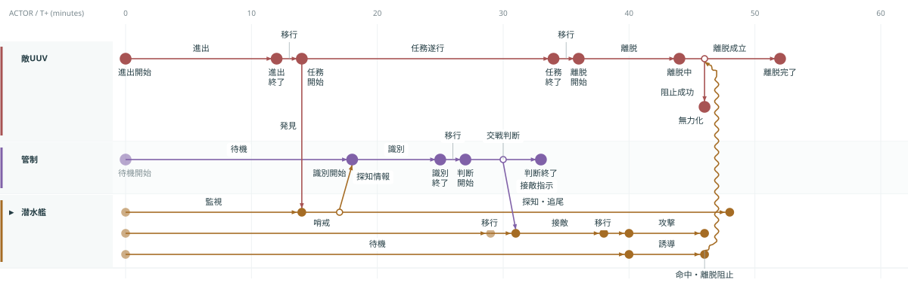
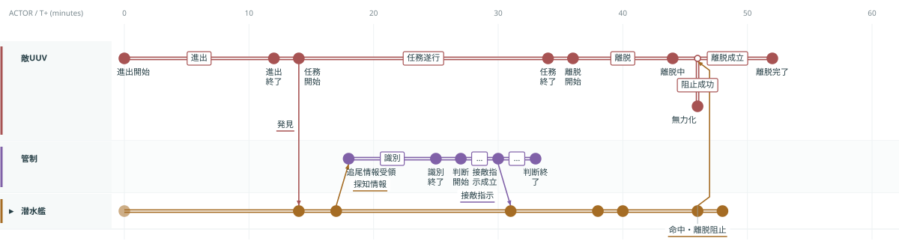
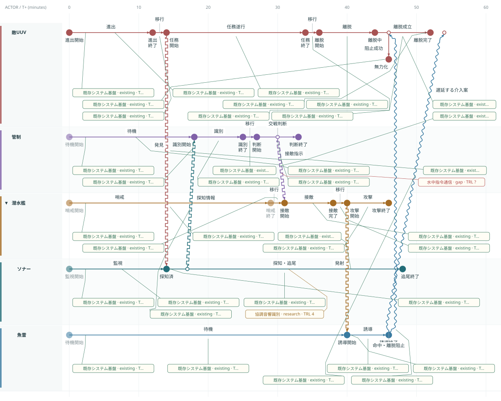

# 比較用サンプルと表現デモ

基本・階層・技術Gapの3つは、version 2への再設計直前の **618818426ac7e8e2a4f4ea14af6f0e482c9f8b04** にあった同じミッションを使用します。新旧でActor・行動期間・因果時刻・技術評価を変えず、表現モデルを比較するためのサンプルです。旧データと図はリポジトリにも保存しています。旧データの実績／予定・案のメタデータも比較用に保持しますが、現在の画面や分析には使いません。

## 基本：海域監視 — 敵UUVの任務阻止

敵UUVが進出し、任務を遂行、離脱しようとします。海底センサーの探知・追尾、管制の識別と交戦判断、味方UUVの接敵・攻撃、魚雷の誘導を経て離脱を阻止します。

| 因果 | 発生 → 到達（分） |
| --- | --- |
| 敵の任務遂行 → センサーの発見 | 14 → 14 |
| 探知・追尾 → 管制への探知情報 | 17 → 18 |
| 交戦判断 → 味方UUVへの接敵指示 | 30 → 31 |
| 攻撃 → 魚雷の発射・誘導 | 40 → 40 |
| 誘導 → 敵の離脱阻止 | 46 → 46 |

旧図で予定だった52分の離脱完了と、実際の46分の無力化を保ちます。離脱成立Taskは44〜52分のまま、46分に命中の負の因果が入り、無力化へ分岐します。通常の離脱完了への線は、阻止できなかった場合の予定経路です。

## 階層：潜水艦グループ — ソナー・魚雷による任務阻止

基本と同じ敵・時刻・行動・因果を使い、味方UUVを「潜水艦」に変更してグループ化し、ソナーと魚雷をその子Actorにします。これは旧階層サンプルと同じ構成です。敵Actorはこの例でも敵UUVであり、敵を潜水艦へ差し替えてはいません。

潜水艦を折りたたむとソナー・魚雷の行は隠れ、State・Taskを潜水艦のタイムラインと色で表示します。内部の因果線だけが非表示になり、管制・敵UUVとの因果線は時刻を維持して残ります。実データの所属・色は変更せず、展開すると元へ戻ります。

表示設定で間隔を切り替えられます。コンパクトは28px間隔でTask名を表示し、State名はホバーで確認します。

1本表示は重なる活動区間と同時刻のStateを統合します。State・Task名はホバーで確認し、ダブルクリックで展開して編集します。

## 技術Gap：同じ介入経路の能力不足・遅延を調べる

旧技術例と同じ「既存システム基盤」「協調音響識別（研究中・TRL4）」「水中指令通信（gap）」を保持します。旧Stateの行動期間に付いていたBindingはそのTaskへ、旧Transitionは対応Taskへ、旧InteractionはCausalLinkへ移します。

46分の命中経路は離脱成立の時間窓44〜52分に入りますが、協調音響識別と水中指令通信が未充足です。54分に届く「遅延する介入案」も残し、時間窓外と表示します。SOME / ALLは登録データ上の判定で、実世界の成功率ではありません。技術成熟度は旧例と同じ架空の評価です。

初期表示では図の比較を優先し技術注記を隠しています。「技術」を表示しTechnology / Gap Viewへ切り替えるとBindingを確認できます。

## 表現デモは別に保持

「捜索・識別・通信」の小さな説明用シナリオは、メニューの **表現デモ（捜索・識別・通信）** へ分離しました。JSONは `examples/tutorial/` にあります。比較用サンプルを置き換えません。LLM向けの完成例も、この説明用シナリオを使用します。

[新旧の対応表と並べて見る図](sample-migration.md)に、変換判断と元データを記載しています。

## 技術注記の配置

同じ技術GapサンプルでTechnology Viewと技術表示を有効にした図です。吹き出しは行内の注記領域に置き、必要な行高さを自動で確保します。

