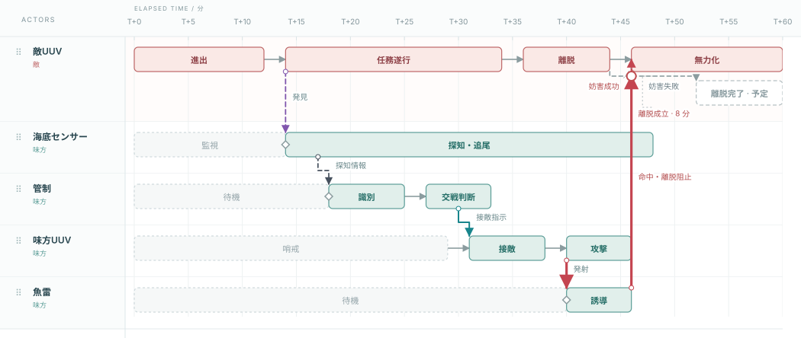

# 旧シナリオとの比較・変換対応

比較基準：[version 2再設計直前のcommit 6188184](https://github.com/Zero-error-no-warning/IMEE/tree/618818426ac7e8e2a4f4ea14af6f0e482c9f8b04)。記憶から再作成せず、このコミットのJSONとSVGをそのまま保存しています。

| 例 | 旧JSON（v1・閲覧／比較専用） | 新JSON（v2・編集用） |
| --- | --- | --- |
| 敵UUV対処 | [coastal](../examples/comparison-v1/coastal.json) | [coastal](../examples/coastal.json) |
| 潜水艦グループ | [submarine](../examples/comparison-v1/submarine.json) | [submarine](../examples/submarine.json) |
| 技術Gap | [research](../examples/comparison-v1/research.json) | [research](../examples/research.json) |

旧JSONはv2エディタへ読み込めません。v1一般の自動インポートを追加したものではありません。

## 期間の扱い

旧サンプルはState名に「進出」「識別」「接敵」などの行動を記載していました。その行動期間をそのままTaskに移し、両端を時点Stateにします。単に旧startだけを残して終了時刻を捨てる変換はしません。

| 旧State ID | 行動／結果 | 旧期間（分） | v2の扱い |
| --- | --- | --- | --- |
| e1 | 進出 | 0〜12 | 同期間のTask |
| e2 | 任務遂行 | 14〜34 | 同期間のTask |
| e3 | 離脱 | 36〜44 | 同期間のTask |
| e4 | 離脱完了 | 52〜60 | 52分の予定State。60分までの保持は暗黙 |
| e5 | 無力化 | 46〜60 | 46分の実績State。60分までの保持は暗黙 |
| s1 | 監視 | 0〜14 | 同期間のTask |
| s2 | 探知・追尾 | 14〜48 | 同期間のTask |
| c1 | 待機 | 0〜18 | 同期間のTask |
| c2 | 識別 | 18〜25 | 同期間のTask |
| c3 | 交戦判断 | 27〜33 | 同期間のTask |
| u1 | 哨戒 | 0〜29 | 同期間のTask |
| u2 | 接敵 | 31〜38 | 同期間のTask |
| u3 | 攻撃 | 40〜46 | 同期間のTask |
| t1 | 待機 | 0〜40 | 同期間のTask |
| t2 | 誘導 | 40〜46 | 同期間のTask |

開始ノードには旧State ID、行動Taskには `activity-旧ID`、終了ノードには `end-旧ID` を使います。State名に開始／終了を付け、Task名は元の行動名を保ちます。実績／予定、active／quietは元の値です。ただし旧status / proposedは互換用メタデータとして保存するだけで、現在の表示・分析には使いません。Actorに編集可能なcolorを補完します。Actor名・所属・階層・順序・notes、時間単位・全期間・スナップも保持します。

同時刻の前後接続（監視終了＝探知開始、待機終了＝識別開始、魚雷待機終了＝誘導開始）は1つのStateを共有します。正の長さを持つ旧Transitionは旧IDのTaskとして同じ時間幅で残し、名称のなかったものだけ「移行」と表示します。新しい行動内容や遅延を追加した意味ではありません。

## 離脱阻止の変換判断

- 旧 `escape` は離脱終了44分→離脱完了52分。新Taskも **44〜52分** を保持します。
- 46分の命中をTask上の白丸に接続し、「阻止成功」から同じ46分の無力化Stateへ分岐します。
- 阻止失敗時の予定経路は、白丸から52分の離脱完了まで続く実線です。Task名「離脱成立」で示します。旧図の予定タグは表示しません。
- 旧 `disabled` の直接遷移は同じ結果を指すので成功枝へ統合します。二重の無力化経路を作りません。
- これにより主Taskに接続先Stateと途中の分岐を併用します。介入窓を白丸の46分で切り詰めません。
- 54分の遅延案は元の時刻・proposedを保ちます。52分より後のため窓外です。

旧Interactionが期間Stateの途中から出ていた場合は対応Task上の同時刻へ接続し、開始・終了と一致する場合はそのStateを使います。すべての発生・到達時刻、kind、label、正負、案の区分を比較テストで確認します。

## 技術・分析メタデータ

旧Stateの行動へのBindingは行動Taskへ、到達結果へのBindingはStateへ移します。ゼロ時間TransitionへのBindingは共有Stateへ、`disabled`へのBindingは分岐を持つ`escape`へ移します。技術カタログ、Binding ID・件数・参照Technologyは保持します。

旧検知リンクは「敵→センサー」の向きです。これを逆向きにはせず、味方の「探知・追尾」Taskに`kind: observation`を設定し、旧例の観測役割を維持します。旧c3の`phase: decision`は開始Stateへ引き継ぎます。これは交戦判断の役割であり、27分に判断が完了したと主張するものではありません。元の30分の指令はTask途中から発生します。

Stateから行動Taskへ分割するため、分析経路の要素数は増えます。旧版と経路件数が同一とは主張しません。シナリオ、イベント時刻、技術不足、介入窓を比較します。

見た目だけの変更として、行高を44pxから64pxへ広げ、初期の技術注記を非表示にしています。ノードや因果端点のX座標を動かして空間を作ってはいません。

## 図を比較

旧版（同一シナリオ）：



新版：


[旧・潜水艦グループ](comparison-v1/grouped.svg) ／ [新・潜水艦グループ](grouped.svg)

[旧・技術Gap](comparison-v1/research.svg) ／ [新・技術Gap](research.svg)

## 再生成・検証

`examples/comparison-v1/` の3つの旧JSONが固定の変換元です。ID単位の[機械可読な対応台帳](../examples/comparison-v1/mapping.json)も生成します。

```sh
node scripts/restore-comparison-samples.cjs
node scripts/update-examples.cjs
npm test
```

`restore-comparison-samples.cjs`はこの固定サンプル専用です。元データを変更して新旧を同じことにする運用はしません。機能デモは`js/tutorial-sample.js`から別に生成します。
