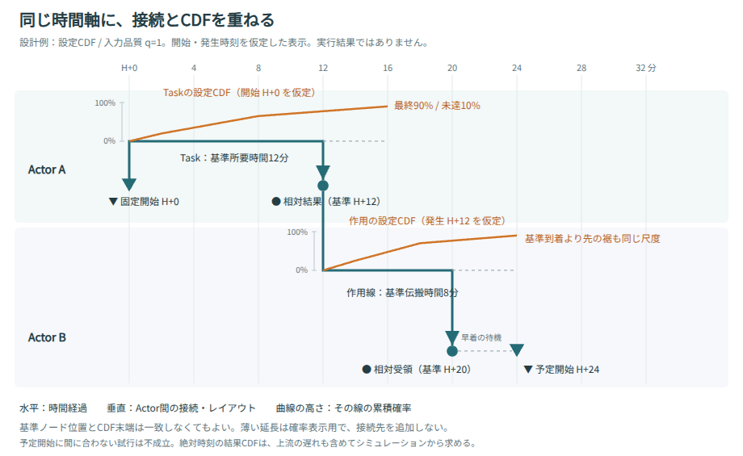

# IMEEの時間軸・直交線・ノード・図上CDFの設計案

状態: 主要機能を実装。2026-10-01。詳細な実装状況は次の節を参照。本書の後半は当初の設計検討を保存しており、将来段階の提案も含む。

対象ブランチ: `feat/shared-time-axis`。操作性改善ブランチから分けて実装した。

## 実装状況（アプリ 0.5.0）

- 全Actorで共通の線形時間軸を維持。Task、作用線、結果線、待機線を直交化し、水平区間とCDFの裾を含めてレーンを自動配分する。接続のない交差は縦線の下地で区別する。
- Relative / FixedをState編集と詳細パネルで選択。新規活動はFixed開始点とRelative成果を作る。Fixedドラッグは指定時刻だけを変え、入力Taskの所要時間を保つ。Relativeの複数入力は成立時刻を決める入力か、明示的に選んだ1入力を調整する。
- Fixedは厳密な予定イベントとして実行。早着は待機、遅着は未成立。AND/ORの品質は条件成立時に確定し、同時刻のゼロ時間連鎖と開始依存を処理する。結果CDFは指定時刻でのみ跳ね上がる。
- 設定CDFは真の基準開始条件成立時刻に所要時間を加えて横軸へ重ねる。入力qは表示用で、入力品質・CDF・Simulation overrideを変更しない。t=0の確率質量、最終p<1、基準終点を越える裾を保持する。
- 結果CDFは実試行のTask通常完了・作用実到着・State成立を別々に集計し、全試行で割る。ノードの基準位置を動かさず、上流遅延、品質、分岐、中止、未発生を含む分布を表示する。計算条件を変更したら図上の旧結果を解除する。
- CDF非表示／設定／結果、選択中／すべて、時刻カーソル、曲線全期間表示、SVG/PNG出力、デモJSONを提供する。CDFの編集は曲線をダブルクリックして既存グラフ・数値表で行う。

当初案の全面的なversion 4移行は行わず、version 3に任意の`State.timing`と`Task.timing.duration`を追加した。既存データを読み込むだけでは実行条件を変えない。時間種別を変更する際は、そのノードにつながるTaskの従来所要時間・結果遅延を明示値として保持する。旧アプリで新しいFixed指定のJSONを扱う場合の動作互換は保証しない。

未実装の将来段階は、日時原点・日付・タイムゾーンを伴う09:30やD-Day入力、図上の点を直接ドラッグするCDF編集、複数qの包絡表示。現在の固定時刻はH+経過時間で指定する。旧モデルの基準時刻キャッシュは読み込み時に全面変換しないため、追加待機がある旧Taskの基準図は従来の時刻を保持する。

結果分布の格子は初期幅`time.duration / 512`。各対象1024区間を超えたら幅を倍にして再集計し、表示に格子幅を明記する。確率の分母・達成件数は正確で、時間は各区間の上端へ丸める。Fixed成立時刻は丸めない。作用の`accepted`は入力受領であり、AND成立や分岐適用を意味しない。図上は実到着を表示し、成立はノードCDFで確認する。

[実装済みデモJSON](../examples/time-axis.json) / [設定CDFの図](time-axis-config.svg) / [結果CDFの図](time-axis-results.svg)

## 1. 採用する基本原則

1. シナリオ図の横座標は、全Actorで共有するシナリオ時刻に対応する。`x(t) = left + scale × (t − visibleStart)`。
2. 縦座標はActor、同時進行、接続経路を表す。縦線の長さや折れ曲がりに時間的意味を持たせない。
3. Task・作用線は原則として「垂直 → 水平 → 垂直」の直交線とする。同じ高さで衝突しない場合は水平一本も許す。
4. 水平区間は、その左右端の時刻差を表す。重なり回避によって左右端の時刻やノードの横座標を動かさない。
5. Relative Nodeは `●`、Fixed-time Nodeは `▼`。所要時間がFIXであることと、ノードの成立時刻が固定であることは別の意味である。
6. CDFは共通の横時間軸へ重ねる。縦方向の曲線の高さだけは、その線に付属する小さな確率軸を使う。Actorの縦座標とは区別する。

線の長さを稼ぐための横迂回、後戻り、時間軸の局所的な伸縮は認めない。密度が高ければ縦方向のレーンと図の高さを増やす。



## 2. 現行実装との対応

| 領域 | 現行の仕様・実装 | 提案する扱い |
| --- | --- | --- |
| 共通時間軸 | `layout.viewport()` は時間を横座標へ線形変換する | 維持する |
| Stateの時刻 | `State.time` は図の基準時刻。入力を持つStateの実時刻は実到達から決まる | Relative Nodeの基準表示に対応。ただし現在は種別を保存していない |
| 初期State | 通常は `State.time` に外生的に発生する | 入力・暗黙依存のない初期StateはFixed-time Nodeの移行候補 |
| 固定時間Task | `taskWindow.end − taskWindow.start` を実行所要時間に使う | 所要時間をTask自身へ明示保存する必要がある |
| Taskの追加開始条件 | 追加の待機条件・品質入力を待ってから開始する | CDFの原点は実際のTask開始。接続元Stateの成立と分けて表示する |
| 作用線 | `source.time + propagation.duration` が図の基準到着。CDF実行時はCDFから所要時間を直接抽選する | 基準伝搬時間とCDFの意味は維持する。到着点と受け手の成立点は必要なら分ける |
| ルート | 直線から始め、競合時は斜めの平行迂回も作る | 時間を変えない専用の直交ルーターへ置き換える |
| CDF | 入力品質ごとの所要時間分布。最終p未満の残余は不達 | 図上へ写像できる。最終pを1へ正規化しない |
| 集計結果 | Mission CDF、Task開始・終了のP50/P90、作用線遅延のP50/P90、第1試行履歴 | 各ノード・Task・作用線の絶対時刻CDFは追加集計が必要 |
| 折りたたみ | 内部の複数Taskを一本の集約線へまとめる場合がある | 集約線に個別CDFを混ぜない。展開か対象選択で確認する |

確認した主な実装は `js/model.js` の `taskWindow` / `nominalStart` / `dependencyGraph` / `validate`、`js/layout.js` の `viewport` / `createEdgeRouter` / `layout`、`js/performance.js` の `distribution` / `sample`、`js/simulation.js` の `compile` / `trial` / `createRun`、`js/render.js` の描画処理。公開ドキュメントは [data-model.md](data-model.md)、[simulation.md](simulation.md)。

## 3. Relative NodeとFixed-time Node

### Relative Node: 成立時刻が前段から決まる

基準図の位置は、固定所要時間・CDFの基準所要時間・合流・開始条件から算出する。実行中は試行ごとの実到達を使う。図上の基準位置を、その時刻で必ず成立する保証として扱わない。

- Task出力: `arrival = actualTaskStart + sampledOrFixedDuration`。
- 作用線到着: `arrival = actualSourceTime + sampledOrFixedPropagation`。
- AND合流: 必須の生成元がすべて到達した時刻。品質は従来どおり最小値。
- OR合流: 最初に条件が成立した時刻。同時刻までの品質の最大値を採用し、後着で品質を上書きしない。
- 分岐作用の暗黙開始依存は引き続き必須。通常のOR入力や品質入力へ混ぜない。

Relative Nodeは、位置を直接固定する代わりに、関係する所要時間を編集する。ドラッグ時には「どのTask・伝搬時間を変更するか」と後続への影響をプレビューする。複数の入力がある場合は、都合よくすべての時間を変更せず、対象の選択が必要になる。

初期版では、入力も時刻アンカーもないRelative Nodeは作成途中として保存できるが、実行時には未設定エラーにする。基点にはH+0などのFixed-time Nodeを置く。「後続の固定時刻から逆算した開始」は計画支援として別途検討し、確率モデルから実開始時刻を勝手に逆算しない。

### Fixed-time Node: 指定時刻の予定イベント

推奨する初期仕様は、指定時刻 `F` にだけ成立する予定イベントである。

- 入力なし: Actor停止など既存の実行制約がなければ `F` に外生的に発生する。
- 入力あり: 既存のAND/OR条件と必須の開始依存が `F` までに成立していれば、早着入力を保持し、`F` に成立する。
- 条件が `F` に間に合わなければ、その試行では不成立。ノードを右へずらして実行しない。
- 後続Task・作用線はFixed-time Nodeが実際に成立した場合だけ開始・発生する。
- ORは早着で条件成立した時点の品質を保持する。指定時刻まで後着の良い品質を集める挙動は、既存ORと異なるため初期仕様へ混ぜない。
- ANDも条件成立時点で入力を確定する。待機時間による品質劣化は現行モデルにないため、暗黙に追加しない。
- 時刻 `F` と同時の到着は間に合う。時刻内の到着処理、合流条件確定、固定イベント成立、後続開始の順序を明文化する。

同時刻の判定は、単純にFixedイベントへ一つの優先度番号を付けるだけでは足りない。H+30で開始したゼロ時間Task・伝搬や、同時刻のFixed同士の依存も扱うため、同時刻イベントを依存順に処理して、その時刻の成立可能性が確定してから未成立を判定する。循環は禁止したまま、時刻を微小量だけずらす実装は避ける。

**固定時刻は期限と別である。** 「09:30に開始する」はFixed-time Node。「09:30までに完了する」はRelative Nodeの達成期限であり、早く完了した結果を09:30まで遅らせる意味にしない。Missionの既存deadlineも維持する。

現行の期限指定はMission単位である。個別ノードの期限を入力するUI・保存項目は別の拡張であり、本案のFixed種別を使って代用しない。

`max(F, 入力到達)` は「指定時刻より早く始めない」という下限制約であり、厳密なFixed-time Nodeとは別仕様。必要なら後の拡張として名称と表示を分ける。

## 4. 時刻の保存と互換性

Relative / Fixedを単なるマーカーの違いで済ませると、固定ノードへCDFが到着する場合の実行意味が曖昧になる。ノード種別の本導入はversion 4相当のモデル変更として扱う案を推奨する。

以下はスキーマ案で、現行JSONへそのまま追加して使えるものではない。

```json
{
  "id": "ready",
  "actorId": "sensor",
  "name": "探知成立",
  "timing": { "mode": "relative" },
  "simulation": { "join": "all" }
}
```

```json
{
  "id": "scheduled-start",
  "actorId": "control",
  "name": "予定開始",
  "timing": { "mode": "fixed", "at": 30 },
  "simulation": { "join": "all" }
}
```

| データ | 保存する意味 | 計算・表示する値 |
| --- | --- | --- |
| Relative State | `timing.mode`、既存の入力参照・合流条件 | 基準成立時刻、試行ごとの成立時刻、成立時刻CDF |
| Fixed State | `timing.mode`、指定時刻 `timing.at` | 指定時刻までの条件成立率、実成立/不成立 |
| Task | `timing.duration` を基準所要時間として明示保存。FIXでは実行所要時間、CDFでは基準図の参照値。既存のCDF・品質・開始条件を保持 | 基準開始・終了、実開始・終了 |
| CausalLink | 既存の `propagation.duration`、CDF、品質 | 基準発生・到着、実発生・到着 |
| 確率Junction | Task内の相対進捗 `progress:0..1`。移行時は旧基準窓から換算 | 基準位置、各試行の分岐時刻 |
| 作用Junction | 受け手Task内の基準オフセット。作用線到着との基準一致を検証 | 図上の目安位置。実際の作用分岐は作用の実到着時刻 |
| Outcome | 分岐後の非負所要時間 `delay` を明示保存 | 結果Stateの基準・実到達 |

Relative Stateの旧 `time` は、保存された独立の真値にしない。計算済み値は読み取り専用の解決結果へ置き、互換表示用に必要なら一時的に生成する。基準位置を動かしただけでFIX Taskの実行所要時間が変わる現行構造を解消する。

基準時刻は実行可能な入力のみで解く。説明用作用線をRelative Nodeの成立時刻を決める生成元へ加えない。説明用線の終点は説明上の基準到着として描けるが、計算から除外されたことを示す。現行の基準検証が説明用線も参照する部分は、この変更時に見直す必要がある。

CDFの基準所要時間は入力する参照値として維持し、最後のCDF点や到達条件付きP50へ自動的に合わせない。到達確率が50%未満でも基準図を作れる。Taskの基準開始には追加待機・品質条件を含め、受け手が固定時刻でも所要時間を締切差分から自動決定しない。

### v3移行案

1. 旧State.timeを含む原文書を保持し、変換前後を比較できるようにする。
2. Taskの基準所要時間は旧 `taskWindow` の差から抽出する。`nominalStart` の差に勝手に置き換えない。そうすると旧FIX実行の意味が変わる。
3. 分岐後遅延・確率分岐の進捗・作用分岐オフセットを、旧窓から明示値へ変換する。ゼロ長窓は分岐進捗を0として別途警告する。
4. 実行生成元を持つStateはRelative候補、入力・暗黙依存のない外生StateはFixed候補とする。旧外生Stateに暗黙開始依存がある場合は、時刻下限＋依存待ちという旧動作を保持する互換アダプターに残し、利用者の確認なしに厳密Fixedへ変換しない。
5. 基準開始条件が接続元より遅い場合、新しい基準終了は従来の見た目から動くことがある。実行時間の保存と図上時刻の再計算を区別して報告する。
6. 同一Seedで旧試行の到達・分岐・品質・成功判定が保たれることを確認する。結果キャッシュはスキーマ移行で無効化し、旧結果は旧入力スナップショットに紐付けて保持する。

基準図の再計算で、旧作用Junctionと新しいTask基準開始の整合が崩れる文書は、伝搬時間を自動調整して変換を通さない。差分を示して互換実行に残し、基準設定を利用者が解決してから移行する。

Technology / Binding、Actor階層、入力品質の補間、品質保持率、Mission成功条件は変更しない。未変換文書は既存のv3実行器で扱う選択肢を残す。

## 5. 直交ルーティングと水平レーン

標準ルートを次の4点で表す。

`(xStart,ySource) → (xStart,yLane) → (xEnd,yLane) → (xEnd,yTarget)`

両端は意味上の時刻を保ったアンカーである。ノードの大きさ分だけ線を隠す処理はクリップで行い、接続ポートを斜め方向へ逃がさない。

### レーン割り当て

1. 先に基準時刻を解き、各水平区間の時間範囲を確定する。
2. CDF表示時は、基準終点だけでなく表示するCDF末端までの範囲と、曲線の高さ・ラベル・余白を予約する。
3. Taskは所属Actorの帯内、作用線はActor間の接続帯を優先する。帯は必要に応じて増やす。
4. 時間範囲が重なる線は同じレーンへ置かない。CDFの予約領域と他の線の衝突も判定する。有限な横領域と縦領域の双方に余白を設ける。
5. 同じ時間帯の線をまとめて割り当て、端点位置・前回レーン・折れ数・縦距離・交差数を評価する。表示フィルタや選択で全線が上下に飛ばないよう、既存レーンを優先する。
6. 収まらなければActor行・接続帯を縦に拡張する。水平区間を斜めにする、重ねる、横へ迂回することで解決しない。

「水平区間同士が重ならない」は基本保証にする。一方、密な有向グラフの全交差除去は保証しない。縦線と水平線の交差は、線の短い切れ目などで非接続と示し、点のない交差を分岐として読ませない。縦線同士の共用も勝手に束ねない。端点でどうしても一致する場合は、選択時の強調と接続一覧を使う。

ゼロ所要時間は同じxの垂直接続または同時刻マーカーで表す。見やすさのために水平時間を追加しない。長い線の画面外部分はクリップし、意味上のレーン割り当てはズーム前の時間範囲を使う。

### 合流・待機・後着

- AND早着: 作用線の到着点から成立時刻まで、別の水平区間で「待機」を示す。待機時間も時間経過なので水平である。
- OR後着: 到着時刻に未採用マーカーを置く。成立済みノードへ左向きの時間線を戻さない。
- Fixed早着: 到着時刻から指定時刻まで待機を示す。Fixedより遅い到着は、その時刻に「予定時刻超過」を示す。
- Taskの追加開始待ち: 接続元StateからTask実開始アンカーまで待機区間を描く。CDFのt=0はその開始アンカーに置く。

到着点、開始アンカー、分岐点は線に付属する補助記号であり、利用者が作る第三のState種別ではない。描画のためだけのState・Taskを文書へ増やさない。

## 6. 図上CDF: 設定分布と実行結果分布

### A. 設定CDF: 開始・発生からの所要時間

現在のモデルをそのまま使う表示である。Taskは基準の実開始時刻 `sRef`、作用線は基準発生時刻 `sRef` を原点とする。

`x = x(sRef + τ)`、`y = yLane − probabilityHeight × F(τ | inputQ)`

確率軸の0%は水平線、100%はその上の専用小領域。線に「設定CDF / 入力品質q=… / 開始T+…を仮定」と表示する。入力品質が未確定なら、選択したプレビューqまたは入力q全体の包絡を示し、実到達時刻の推定と呼ばない。包絡は信頼区間ではない。

- 基準終了より先にCDF点がある場合、曲線と薄い時間軸を同じ尺度で延長する。基準ノードを移動せず、その延長へ接続矢印も付けない。
- 基準終了より前に最終点がある場合も、水平軸を勝手に縮めない。最後の累積確率を維持する。
- 到達確率90%なら100%へ引き伸ばさず「未達10%」を表示する。
- t=0の確率質量は垂直の跳びで示す。CDF曲線の斜め・垂直部分はグラフ表現であり、接続線ではない。
- FIXは必要なら所要時間の位置で0→100%となる段差を示す。上流が揺らげば絶対完了時刻は分布するため、FIXだけで結果時刻が固定とは表示しない。
- 確率分岐・中止を持つTaskの設定CDFは、本来の処理所要時間の分布である。「通常到達先へ到達する確率」へ読み替えない。
- 品質保持率はCDFの高さへ混ぜず、カーソル時の補足値や詳細で示す。

CDF形状は厳密に単調な補間を使い、見た目だけの滑らかな曲線でpの上下振動を作らない。

### B. 結果CDF: シナリオ上の絶対完了・到着・成立時刻

利用者が「いつ完了するか」をシナリオ全体で読む主表示はこちらである。シミュレーション結果から、共通の絶対時刻軸に経験CDFを描く。

`G(t) = 時刻tまでに対象イベントが実際に成立した試行数 / 全試行数`

- Taskは通常完了、作用線は到着と作用成立を区別し、ノードは成立を集計する。
- Taskが未開始・中止・分岐した試行、作用が未発生・未達・遅着で不成立の試行も、対象イベントの分母から除かない。
- 到達条件付きのP50/P90は補助値として明記する。全試行のG(t)が0.5へ達しないなら、無条件P50は得られない。
- Task開始が不確実な場合、設定CDFを一回だけ横にずらした図や、上流P50＋所要時間P50で代用しない。開始時刻・入力品質・分岐・中止の相関を含む実試行で集計する。
- Fixed-time Nodeの結果CDFは、指定時刻Fで「間に合って成立した割合」だけ上がる段差となる。不成立の残余は右へ流れる分布ではない。
- 既存の基準ノードは実結果によって動かさず、曲線・P50/P90・試行再生を重ねる。基準のモデルと結果スナップショットを取り違えない。

現行結果には各Stateの全試行時刻や各作用の絶対到着CDFがない。第1試行のtraceやP50/P90から曲線を復元してはいけない。追加集計として、対象イベントごとの有限時刻・未成立数、作用の到着/成立/遅着を保持する。全対象では点数とメモリに上限を設けた単調な時刻グリッド集計を使い、固定時刻はグリッドへ必ず含めて段差をずらさない。近似グリッドであることと実試行数を表示する。固定時刻の成立率は正確な件数で出す。

同一時刻のイベント順を保ちつつ「到着」と「受け手条件の成立」を別に記録する。現在のacceptedは、AND待ちの入力受け入れも含み得るため、名前を変えただけでノード成立率に使わない。

## 7. 分岐・作用の整合

- 確率Junctionは現行どおりTask所要時間に対する相対進捗で実行する。表示位置は基準進捗の時刻に対応する。
- effect Junctionは、受け手Taskの実行中に作用が到着した時刻に分岐する。図の基準Junction位置をFixed-time Nodeへ変換しない。
- 作用線の設定CDFは発生元Stateの実際の成立を原点にする。対象Taskの完了までに作用できる割合は、両者の実行時間・依存・相関を含む結果として集計する。
- 作用がTask開始/完了と同時なら、現在の「作用を完了より先に処理する」規則を維持する。Fixed-time判定も同時到着を含めるようイベント層を整理する。
- 接続元がFixed Nodeでも、暗黙開始依存が指定時刻に間に合わなければその作用は未発生。固定ノード自体を遅延させて依存矛盾を隠さない。
- 循環、負の所要時間、予定時刻の確定的な超過は作成時に診断する。CDFの裾が予定時刻を超えるケースは構造エラーではなく確率的な未成立として評価する。

## 8. 時刻の表示: 09:30 / H+30 / D-Day

内部計算は既存と同じ数値のシナリオ経過時間へ統一する。Fixedのatも同じ数値であり、Actorごとに独立の時計を作らない。

- H+30: どのH時刻を基点とするかを文書で定義する。単位は表示で明示する。
- 09:30: 文書の基準日付・タイムゾーンからシナリオ経過時間へ変換する。日付を省いて翌日の同時刻と混同しない。
- D-Day 10:00: 文書のD-Day日付とタイムゾーンを使って同じ軸へ変換する。
- 基点・タイムゾーンを変更する操作は、表示だけ変更するか、指定した実時刻を保持して数値を再計算するかを選び、影響をプレビューする。

最初の導入はH+形式までとし、実日時の入力は基点・日付越え・タイムゾーンを含む次の段階に分ける案が適切。時刻ラベルを装飾しただけで実日時入力に対応したとは扱わない。

## 9. 作成・閲覧の操作

| 操作 | 推奨する振る舞い |
| --- | --- |
| Task追加 | 所要時間を入力するとRelative結果ノードが作られる。開始が未定なら実行前に時刻アンカーを求める |
| 固定予定追加 | Fixed Nodeを作り、指定時刻と「間に合わなければ不成立」の意味を示す |
| ノード種別切替 | 基準時刻、予定待ち、後続開始、成功率への影響を説明し、Undo一回で戻せる |
| Relativeを横ドラッグ | 時間パラメータ変更のプレビュー。固定予定が押し出される場合は予定を動かさず警告する |
| Fixedを横ドラッグ | 指定時刻自体を変更する。入出力の所要時間を勝手に縮めない |
| Actorの上下移動 | レーンを再配置する。時刻・性能・結果の計算条件は変えない |
| CDF表示 | 「非表示 / 設定 / 結果」を切り替える。結果未実行時に設定曲線を結果として出さない |
| CDF編集 | 選択した線だけ高さを拡張。横ドラッグで点の所要時間、縦ドラッグで確率を編集。数値表も残す |
| CDFプレビュー | 入力qは上流品質を上書きしない。設定と結果を同時表示する比較は選択対象に限定する |
| 図上カーソル | 共通時刻のガイドを引き、その時刻までの完了/到着/成立率と遅着・未成立を表示する |
| 折りたたみ | 内部CDFを加算・平均しない。「複数分布」を示し、対象選択または展開を促す |
| SVG/PNG出力 | ノード種別、表示モード、確率軸、入力q、結果の試行数・凡例を含める |

通常表示は選択した線と注目対象にCDFを出し、「全CDFを表示」も用意する。全表示では高さを増やし、画面外を仮想化する。横時間尺度を縮めて曲線を押し込めない。円/三角・線種・ラベルを併用し、色だけに意味を依存しない。

## 10. 数値例による読み方

| 例 | 期待する表示・計算 |
| --- | --- |
| Task開始H+10、基準所要時間8、CDF点τ=5でp=0.6 | 設定CDFの60%点はH+15。基準結果NodeはH+18。基準終了まで曲線を引き伸ばさない |
| 同Taskでτ=12にも点がある | 曲線をH+22まで延長。H+18の基準ノードは維持し、延長を別のTaskと読ませない |
| 開始時刻自体がH+10またはH+20に揺らぐ | 設定表示は開始仮定を明記。絶対結果CDFは実試行から計算する |
| ANDへの到着H+12とH+18 | RelativeはH+18。先着入力のH+12→18は水平の待機表示 |
| ORへの到着H+12とH+18 | RelativeはH+12。H+18は後着未採用。左向きの時間経過線を引かない |
| 入力がH+12に揃い、FixedはH+30 | H+12→30の待機。成立時刻はH+30。早着時点で後続を開始しない |
| 入力がH+31に揃い、FixedはH+30 | Fixedは不成立。その試行の後続は開始せず、予定時刻も移動しない |
| 80%がH+30に間に合うFixed | 結果CDFはH+30で0→0.8。右側に残り20%の遅い成立を描かない |
| 固定所要時間5、Relative開始が分布する | Taskの設定はFIXでも、絶対完了時刻は開始の分布を5だけ移動した分布になる |
| 到達確率40% | 曲線は最大40%。到達条件付きP50と、存在しない無条件P50を区別する |

図の形と時間軸の対応は [time-axis-design.svg](time-axis-design.svg) を参照。数値・曲線は説明用で、既存シナリオの実行結果ではない。

## 11. 段階的な導入案

| 段階 | 内容 | 実行モデルへの影響 |
| --- | --- | --- |
| A: 表示試作 | 直交ルーティング、レーン予約、設定CDF、凡例、クリップ、エクスポート | 既存v3を維持。Fixed種別はまだ導入しない |
| B: 結果表示 | 各イベントの絶対時刻CDF、分母の区別、カーソル、結果スナップショット | 集計を追加。既存の抽選・到達規則は維持する |
| C: 時間モデル | Relative / Fixed、Task所要時間の明示保存、予定時刻のイベント判定、v3移行 | version 4相当。既存結果を再評価する |
| D: 実日時 | H / D-Day基点、日付・タイムゾーン、実日時入力 | 数値時刻への変換と基点変更規則を追加する |

段階AとBで、提案の読みやすさを既存シナリオで確かめられる。厳密Fixedの導入までを一括で行うと、見た目の改善と計算意味の変更を切り分けて評価しにくい。

## 12. 設計の受け入れ条件と未決事項

受け入れ条件:

- Task・作用線の経路の各区間が水平または垂直で、意味上の横座標が一致する。
- 重なり回避・Actor移動・ズーム・フィルタが、時刻・CDF・同一Seedの実行結果を変えない。
- 水平区間とCDF予約領域の重複を避け、同時刻ノード・ゼロ時間・複数分岐・折りたたみ・狭い画面でも意味を保持する。
- TaskのCDF原点が追加開始待ちの後に置かれる。作用CDFも暗黙の依存で遅れた実発生を反映する。
- CDF末端、未達質量、t=0の跳び、品質補間、分岐・中止の区別が保持される。
- Fixedの早着・同時到着・遅着・AND一部不達・OR後着・Actor停止を評価する。
- 分岐作用が同時刻の完了に先行する既存規則を保持する。
- 結果CDFの全試行分母、到着と成立の区別、予定時刻の段差、古い結果の表示が正しい。
- v3変換前後を同一Seedで比較し、基準図の再配置と実行意味の変化を区別して説明できる。
- キーボード編集、数値表、Undo、図のSVG/PNG保存にも同じ意味を維持する。

決定が必要な項目:

1. Fixedを厳密な予定時刻のイベントとして採用するか。本案はこれを推奨する。時刻下限制約を同じ種別に混ぜるかは別判断。
2. 全CDF表示を既定にするか、選択対象中心にするか。本案は選択対象中心＋全表示切替を推奨する。
3. v3互換実行を残す期間と、暗黙依存を持つ外生Stateの変換方法。
4. TaskのCDF基準所要時間を手入力として維持するか。将来、明示選択した無条件分位点を参照値へ採用する機能を加えるか。
5. 結果CDFの保存点数・対象数の上限と、詳細表示時の再集計方法。
6. 初期導入に実日時まで含めるか。本案はH+形式を先行する。

これらは利用者への確認を要する仕様判断として残す。今回の設計書作成では実装確定として扱わない。
